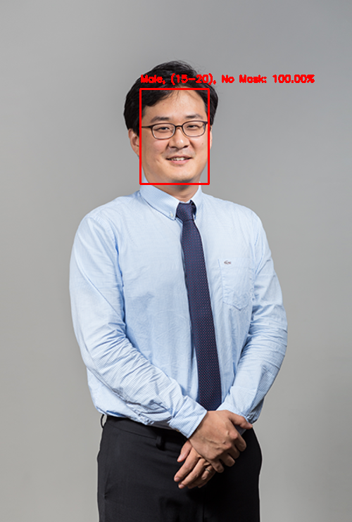

# BT4221 Project

BT4221 Big Data Techniques and Technologies Project.

## Description

COVID-19 Face Mask Detector in Python. Model also predicts the individuals age and gender as supplementary information.

## Setup

`pip install -r requirements.txt`

*Note: activate a virtual environment before running pip install.*

## Usage

### Image

model_image.py makes use of 1 required argument, --image, which specifies the file path to the image file.

`python model_image.py --image test_images/prof.png`

`python model_image.py --image test_images/prof2.jpg`

`python model_image.py --image test_images/prof3.jpg`

### Video

`python model_video.py`

## Sample Output

